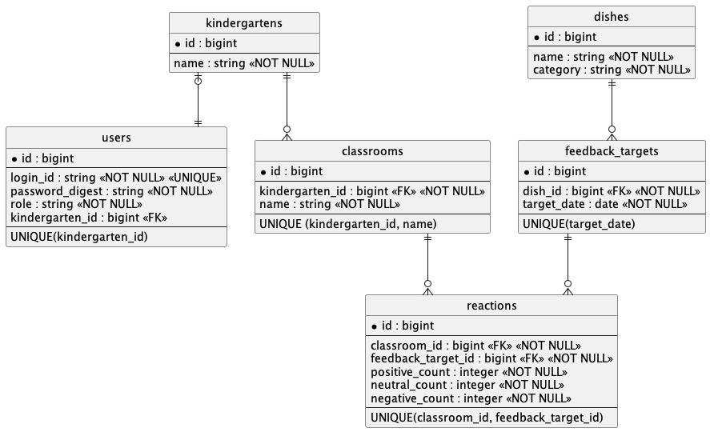

## ER図

## 本サービスの概要

「給食リアクション」は、幼稚園の先生が給食中の園児たちの様子を少ない負担で記録することで、給食センター側へこれまで届かなかった「食べる側の反応」を可視化するWebアプリです。

給食を「作る側」と「食べる側」の間に日常的なフィードバック経路を作り、集まった反応を献立検討時の判断材料の一つとして活用し、その活用内容を幼稚園側へ返すことで、継続的なフィードバックの循環を作ることを目指します。

MVPでは、その最小構成として「リアクションを届ける → 集計する → 当日の全体集計結果を幼稚園側でも確認できる」ところまでを実装します。献立検討への活用結果を幼稚園側へ返す機能は、本リリースで実装します。

幼稚園の先生は、当日のフィードバック対象料理について「美味しそうに食べていた」「普通・どちらでもない」「苦手そうに食べていた」の3種類の人数をクラス単位で入力します。登録されたリアクションは随時集計され、幼稚園側・給食センター側の双方が当日の集計結果を確認できます。

## MVPで実装する予定の機能

### 幼稚園側

- ログイン機能
- ログアウト機能
- 当日の日付表示機能
- 担当クラス選択機能
- 当日のフィードバック対象料理表示機能
  - 「美味しそうに食べていた」人数入力機能
  - 「普通・どちらでもない」人数入力機能
  - 「苦手そうに食べていた」人数入力機能
- リアクション登録機能
- 同日の登録内容の編集・更新機能
- 当日の全体集計結果表示機能

### 給食センター側

- ログイン機能
- ログアウト機能
- 料理マスタ登録機能
  - 料理分類選択
  - 料理名入力
- 当日のフィードバック対象料理設定機能
- 当日の集計結果表示機能
- 各リアクションの人数表示機能
- 各リアクションの割合表示機能
- 観察対象人数表示機能

## テーブル詳細

### テーブル構成

#### users

ログインするアカウント情報を管理するテーブル。

* `id` : bigint / 主キー
* `login_id` : string / ログイン時に使用する識別子 / NOT NULL / UNIQUE
* `password_digest` : string / `has_secure_password` で使用するハッシュ化済みパスワード / NOT NULL
* `role` : string / 幼稚園側アカウント・給食センター側アカウントの判別 / NOT NULL
* `kindergarten_id` : bigint / 幼稚園側アカウントが所属する幼稚園 / 外部キー
* UNIQUE (`kindergarten_id`)

※ 給食センター側アカウントは幼稚園に所属しないため、`kindergarten_id` は NULL を許可します。

---

#### kindergartens

幼稚園そのものの情報を管理するテーブル。

* `id` : bigint / 主キー
* `name` : string / 幼稚園名 / NOT NULL

---

#### classrooms

幼稚園に所属するクラス情報を管理するテーブル。

* `id` : bigint / 主キー
* `kindergarten_id` : bigint / 所属する幼稚園 / 外部キー / NOT NULL
* `name` : string / クラス名 / NOT NULL
* UNIQUE (`kindergarten_id`, `name`)

同一幼稚園内で同じクラス名が重複しないように、`kindergarten_id` と `name` に複合ユニーク制約を設定します。

---

#### dishes

料理マスタを管理するテーブル。

* `id` : bigint / 主キー
* `name` : string / 料理名 / NOT NULL
* `category` : integer / 料理分類 / NOT NULL

料理分類は事前に定めた固定値として扱い、`dishes.category` を Rails の`enum` で管理します。

料理分類は以下の4種類とします。

* 主菜
* 副菜
* 汁物
* フルーツ・デザート

料理分類自体の追加・編集・削除機能は持たないため、独立したテーブルにはせず、`dishes` の属性として管理します。

---

#### feedback_targets

「いつ、どの料理をフィードバック対象にしたか」を管理するテーブル。

給食センター側が事前に「対象日 × フィードバック対象料理」を設定します。

リアクション登録より先に「当日の対象料理」を設定するため、クラス単位の入力結果を管理する `reactions` とは分離します。

これにより、リアクションがまだ1件も登録されていない状態でも、当日の対象料理を保持・表示できます。

* `id` : bigint / 主キー
* `dish_id` : bigint / フィードバック対象となる料理 / 外部キー / NOT NULL
* `target_date` : date / フィードバック対象日 / NOT NULL
* UNIQUE (`target_date`)

MVPでは「1日につきフィードバック対象料理は1品」とするため、`target_date` にユニーク制約を設定します。

---

#### reactions

クラス単位のリアクション記録を管理するテーブル。

* `id` : bigint / 主キー
* `classroom_id` : bigint / リアクションを登録したクラス / 外部キー / NOT NULL
* `feedback_target_id` : bigint / 対象となるフィードバック対象料理・提供日 / 外部キー / NOT NULL
* `positive_count` : integer / 「美味しそうに食べていた」人数 / NOT NULL
* `neutral_count` : integer / 「普通・どちらでもない」人数 / NOT NULL
* `negative_count` : integer / 「苦手そうに食べていた」人数 / NOT NULL
* UNIQUE (`classroom_id`, `feedback_target_id`)

「1クラス × 1フィードバック対象料理 × 1提供日 = 1リアクション記録」とするため、`classroom_id` と `feedback_target_id` に複合ユニーク制約を設定します。

観察対象人数は3種類のリアクション人数の合計から算出するため、独立したカラムとして保持しません。
